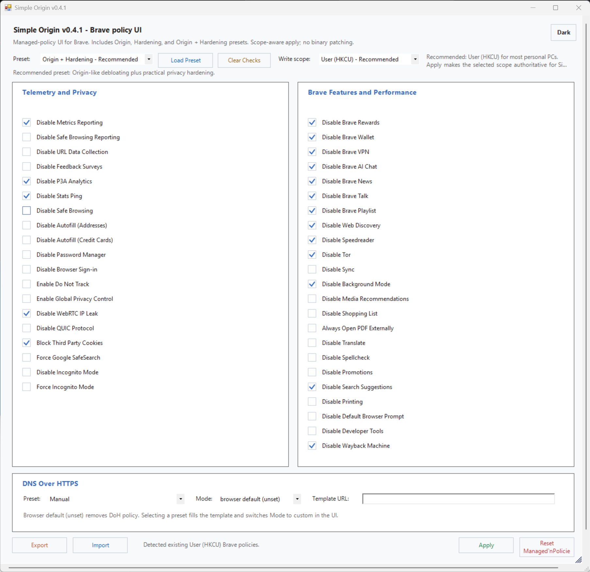

# Simple Origin - Brave Debloat


`SimpleOrigin-Brave-Debloat` is a Windows PowerShell GUI for configuring **Brave managed policies** on **regular Brave**.

It gives you:

- one-by-one policy toggles
- preset-based setup for common configurations
- a `Clear Checks` action to uncheck everything without writing changes
- screen-aware window sizing with scroll support for smaller laptop displays
- DNS-over-HTTPS presets
- import/export for repeatable setups
- a **self-healing one-line launcher** for `irm ... | iex`



## One-line launch

Run the latest stable release:

```powershell
irm https://raw.githubusercontent.com/unmatched785/SimpleOrigin-Brave-Debloat/refs/tags/0.5.3/SimpleOrigin.ps1|iex
```

See [releases](https://github.com/unmatched785/SimpleOrigin-Brave-Debloat/releases) for release notes, older versions, and development builds.

### What makes this safer than a plain raw-script launch

Simple Origin - Brave Debloat now includes a bootstrap path for `irm ... | iex` execution.

If it detects that it was launched directly from memory instead of from a file, it will:

1. download a fresh copy to `%TEMP%\SimpleOrigin-Brave-Debloat\SimpleOrigin.ps1`
2. write that copy as UTF-8 without BOM so `irm ... | iex` and file relaunch use the same script bytes
3. unblock it if needed
4. relaunch from the temp file with `-ExecutionPolicy Bypass`

This reduces the encoding and parser issues that sometimes appear on other Windows laptops when raw PowerShell scripts are executed directly.

Release history is tracked in [CHANGELOG.md](./CHANGELOG.md).

## What this project is

Simple Origin - Brave Debloat is a **policy UI for regular Brave**.

Its goal is to get close to **Brave Origin-like feature reduction** using **officially supported Brave / Chromium policy surfaces**.

It does **not** patch Brave binaries, and it does **not** try to reproduce the separate standalone Brave Origin build.

## Why the Brave Origin context matters

Brave Origin itself is an official minimal Brave variant / upgrade.

Simple Origin - Brave Debloat is **not** that product. This repo exists for users who want a cleaner, more controlled **regular Brave** setup through managed policies, while staying on the documented configuration path that Brave already supports.

## Included presets

### Origin - Recommended

The recommended preset for most users.

It gives you the closest **Brave Origin-like debloat** behavior available through managed policies on regular Brave.

### Origin + Hardening

A privacy-oriented preset that combines Origin-like debloating with practical privacy hardening.

### Hardening

A practical privacy hardening preset for regular Brave. It avoids high-friction lock-down policies while still adding stronger telemetry and network privacy controls.

### Custom

Manual mode. Choose each policy toggle yourself.

## Write scope behavior

**Recommended default: User (HKCU).**

Use **User (HKCU) - Recommended** for most personal PCs. Use **Machine (HKLM)** only when you intentionally want system-wide Brave policy for all users on the device.

The app opens in normal user context by default. It asks to relaunch as administrator only if you choose a Machine-scope action that needs HKLM access.

For the keys managed by this tool, **Apply** tries to make the selected scope authoritative by:

1. writing the selected state to the chosen scope
2. clearing the same managed keys from the other scope when possible

This helps avoid stale mixed HKCU/HKLM states where the UI says one thing but Brave still prefers another because of policy precedence.

## DNS over HTTPS presets

Included presets:

- Manual
- Cloudflare (1.1.1.1)
- Cloudflare Security (1.1.1.2)
- Cloudflare Family (1.1.1.3)
- Quad9 Secure (9.9.9.9)
- Google Public DNS (8.8.8.8)
- NextDNS Public
- NextDNS Custom Profile

Selecting a DNS preset fills the template URL and switches the UI mode to `custom`.

## Policy coverage and limits

This project is **managed-policy first**.

That means:

- it only exposes settings that map cleanly to Brave / Chromium policy
- it intentionally avoids pretending that every Brave setting has a safe policy equivalent
- it prefers correctness over adding fake toggles

### Important note about Brave Shields

This project intentionally **does not** expose a fake global **Disable Brave Shields** toggle.

The Brave policy surface for Shields uses **site lists**, not a true global on/off policy.

A future release may add a **site-specific Shields allow/disable list editor**, but that is separate from a global toggle.

### High-friction toggles

Some policy keys are intentionally kept out of the recommended presets because they can break expected browser workflows or add stronger restrictions, such as:

- disabling Safe Browsing
- disabling the password manager or autofill
- disabling browser sign-in or sync
- forcing or disabling Incognito mode
- disabling printing or developer tools

They are still available for `Custom` setups, but they are kept out of the default recommendations.

## Compatibility

Brave supports Chromium policies plus Brave-specific policies, but **policy availability depends on Brave version**.

Because of that:

- some Brave-specific policies only work on newer Brave builds
- `brave://policy` is the best place to verify what actually took effect
- unsupported policy keys may not show up or may simply be ignored

## Local launch

If you already downloaded the file manually, open PowerShell in the same folder and run:

```powershell
powershell -ExecutionPolicy Bypass -File .\SimpleOrigin.ps1
```

## Safety notes

- Light theme is the default.
- Dark mode is optional via the top-right theme button.
- The app does not request administrator rights on launch.
- Restart Brave after applying settings.
- Verify results in `brave://policy` if needed.
- **Reset Managed Policies** removes the Brave policy values touched by this tool from both HKCU and HKLM.
- If you decline elevation, User-scope Apply still works, but clearing conflicting Machine-scope values may fail.
- This tool does not modify Brave binaries and does not try to impersonate the separate Brave Origin product.

## Roadmap

Near-term follow-up items:

- better mixed-scope conflict reporting
- site-specific Brave Shields list management
- clearer per-policy compatibility / minimum-version notes
- possible future **experimental** layer for non-policy Brave settings that cannot be enforced safely through managed policies
